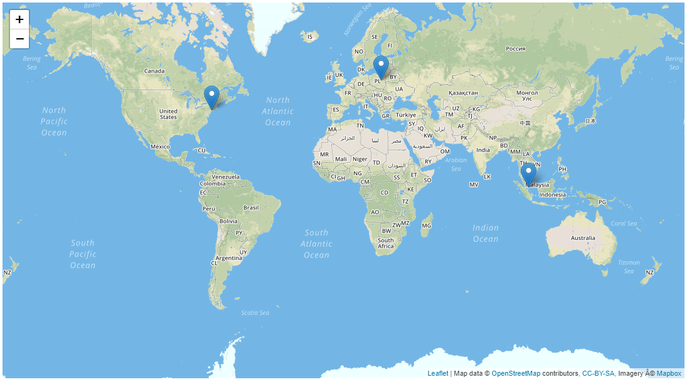

# Leaflet IP Marker 

Implementation of Leaflet maps & IP geolocation detection API.

## Example


## How to use:
1. [Leaflet Quick Start Guide](https://leafletjs.com/examples/quick-start/)
2. Include `leaflet-ip-marker.js` at the end of your `<body>` element. Example:
```html
<script src="dist/leaflet-ip-marker.js"></script>
```
Javascript usage:
```javascript
/* New Class instance */
let marker = new MapMarker();

/* Create map */
marker.createMap("Map HTML DOM id", "Leaflet API key...");

/* ... or you can use your own map */
marker.assignMap(your_map);

/** Place markers on desired IP locations */
marker.markIPs(["116.12.250.1", "72.229.28.185", ""]);
```

## How to build?
```
# TypeScript installation:
npm install -g typescript

# Build files:
tsc
```


## Author:

* **Hubert Rządziński** - [GitHub](https://github.com/Sturmpl) 

## License

This project is licensed under the MIT License - see the [LICENSE.md](LICENSE.md) file for more details

